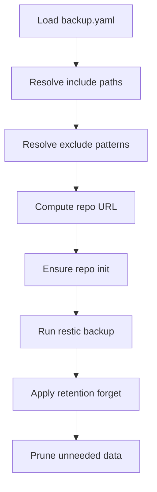
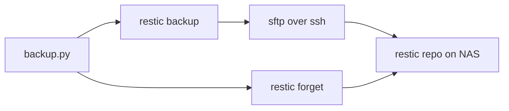

# zuzu-system-backup

A small, opinionated **system + user config backup** tool that uses **restic** to create **deduplicated, encrypted snapshots** on a NAS over **SFTP/SSH**.

This repo started life as “rsync + tarballs”. It is now **restic-first**:

- No “daily tar.gz” piles
- No bespoke rotation logic
- Snapshots are space-efficient (dedupe) and encrypted
- Retention can be “smart” (daily/weekly/monthly/yearly) via `restic forget`

## Backup share layout on the NAS

You can keep the same "automated" root you already use. The key difference is that the destination becomes a **restic repository directory**, not a directory full of tarballs.

Example layout (conceptual):

```text
/share/backup/automated/
  daily/
    system-orion/
      restic-repo/
        config
        index/
        data/
        snapshots/
        keys/
```

Nothing inside `restic-repo/` is meant to be edited by hand. Treat it as an opaque repository and interact with it via `restic`.

## Control flow



## Backup share layout on the NAS

You can keep the same "automated" root you already use. The key difference is that the destination becomes a **restic repository directory**, not a directory full of tarballs.

Example layout (conceptual):

```text
/share/backup/automated/
  daily/
    system-orion/
      restic-repo/
        config
        index/
        data/
        snapshots/
        keys/
```

Nothing inside `restic-repo/` is meant to be edited by hand. Treat it as an opaque repository and interact with it via `restic`.

---

## What it does

- Collects a curated set of **system paths** (e.g., `/etc/...`)
- Collects selected **user dirs/files** (e.g., `~/.ssh`, `~/.gnupg`, etc.)
- Applies **exclude patterns** to avoid cache-bloat
- Writes snapshots into a **restic repository on your NAS** via `sftp:<host>:<path>`
- (Optional) runs retention policy (`forget --prune`) after successful backup

---

## High-level flow



Notes:
- The “repo on NAS” is **not** a browsable mirror of your files. It’s restic’s encrypted, chunked storage.
- You browse/restore using **restic commands** (CLI), not a file browser.

---

## Requirements

On the machine running the backup (e.g. your workstation/server):

- Python 3.11+ (older may work, but 3.11+ is recommended)
- `restic` installed on the OS
- SSH key-based access to the NAS (no password prompts)
- The NAS must allow SFTP access to the destination path

On Arch Linux:

```bash
sudo pacman -S restic
```

---

## Quick start

1) Clone and install somewhere predictable (example):

```bash
sudo mkdir -p /usr/local/sbin/zuzu-system-backup
sudo cp -av backup.py /usr/local/sbin/zuzu-system-backup/backup.py
sudo chmod 0755 /usr/local/sbin/zuzu-system-backup/backup.py
```

2) Create a config:

```bash
sudo cp -av zuzu-system-backup.yaml /usr/local/sbin/zuzu-system-backup/backup.yaml
sudoedit /usr/local/sbin/zuzu-system-backup/backup.yaml
```

3) Create a restic password file (local machine):

```bash
sudo mkdir -p /srv/conf/restic
sudoedit /srv/conf/restic/.pwd.restic
sudo chmod 0600 /srv/conf/restic/.pwd.restic
```

4) Run a first backup manually:

```bash
cd /usr/local/sbin/zuzu-system-backup
sudo ./backup.py --config ./backup.yaml run
```

5) List snapshots:

```bash
# Use the same repo + password file the script uses:
restic \
  -r "sftp:zocalo:/share/backup/automated/daily/system-orion/restic-repo" \
  --password-file /srv/conf/restic/.pwd.restic \
  snapshots
```

(If you like ergonomics: create a shell alias/wrapper, see “Convenience commands”.)

---

## Configuration

An example config is provided in `zuzu-system-backup.yaml`. Keep it generic; don’t commit personal secrets.

### `remote`

Where the NAS is, and where backups land.

```yaml
remote:
  user: backupuser
  host: backup-nas.local
  port: 22
  key: /home/backupuser/.ssh/id_ed25519-orion
  base: /srv/backup/automated
  host_dir: system-orion
```

The script uses:

- `base` + `host_dir` as the logical destination root
- a restic repo directory under that (see `restic.repository` below)

### `restic`

At minimum, you must provide a password file:

```yaml
restic:
  password_file: /srv/conf/restic/.pwd.restic
  # repository: "sftp:zocalo:/share/backup/automated/daily/system-orion/restic-repo"
```

If `repository` is not set, the script derives a default repo path from `remote.base` and `remote.host_dir`.

### `retention`

Time-based, “smart” retention. Typical setup:

```yaml
retention:
  keep_daily: 7
  keep_weekly: 4
  keep_monthly: 6
  keep_yearly: 1
  keep_within: ""     # optional, e.g. "14d" or "3m"
```

These map directly to `restic forget` flags:

- `keep_daily`   -> `--keep-daily N`
- `keep_weekly`  -> `--keep-weekly N`
- `keep_monthly` -> `--keep-monthly N`
- `keep_yearly`  -> `--keep-yearly N`
- `keep_within`  -> `--keep-within DURATION`

### `system.include_paths`

A list of **absolute paths** to include. These can be:

- Files
- Directories
- Globs (e.g. `/etc/systemd/system/*.mount`)

Example:

```yaml
system:
  include_paths:
    - /etc/nftables.conf
    - /etc/snapper/configs
    - /etc/systemd/system/*.mount
    - /srv/data/traefik
```

If you include a directory, restic will back up the directory contents.

### `user`

A base home plus relative directories/files:

```yaml
user:
  home: /home/devuser

  include_dirs:
    - .ssh
    - .gnupg

  include_files:
    - .gitconfig
    - .bashrc
```

### `exclude_patterns`

Exclude patterns are applied to reduce junk. `${USER_HOME}` is expanded.

---

## How much data gets sent when things change?

Restic is chunk-based and deduplicating:

- On the first run, it uploads everything once.
- On later runs, it only uploads **new chunks** (changed file parts) and some small metadata.
- If you change a 10 MiB file, it typically uploads **only the changed parts**, not your whole dataset.

Practical implication: daily runs are usually fast and bandwidth-light unless you have lots of changes.

---

## Convenience commands (recommended)

Create a small wrapper script or alias so you don’t retype the repo/password every time.

Example alias (bash/zsh):

```bash
alias restic-zocalo='restic -r "sftp:zocalo:/share/backup/automated/daily/system-orion/restic-repo" --password-file /srv/conf/restic/.pwd.restic'
```

Then:

```bash
restic-zocalo snapshots
restic-zocalo stats
```

---

## Browsing and restore workflows

### List snapshots

```bash
restic-zocalo snapshots
```

### See what’s inside a snapshot

```bash
# List top-level paths within a snapshot
restic-zocalo ls b21638dd

# List a subpath within that snapshot
restic-zocalo ls b21638dd /home/devuser/.ssh
```

### Search for a file

```bash
restic-zocalo find --name "id_ed25519*"
```

### See “largest stuff” and general size breakdown

```bash
restic-zocalo stats
restic-zocalo stats --mode files-by-extensions
restic-zocalo stats --mode raw-data
```

(For “top N largest files”, restic doesn’t have a perfect single command, but `stats` plus targeted `find` usually gets you there quickly.)

### Restore a single file / directory

```bash
# Restore a directory
restic-zocalo restore b21638dd --target /tmp/restore --include "/home/devuser/.ssh"

# Restore a single file
restic-zocalo restore b21638dd --target /tmp/restore --include "/etc/nftables.conf"
```

### Mount a snapshot (browse like a filesystem)

Restic can mount a FUSE filesystem:

```bash
mkdir -p /tmp/restic-mount
restic-zocalo mount /tmp/restic-mount
```

Then browse under `/tmp/restic-mount/snapshots/...`.

---

## Retention (forget/prune)

This is the “smart versioning” part.

Example manual retention run:

```bash
restic-zocalo forget \
  --keep-daily 7 \
  --keep-weekly 4 \
  --keep-monthly 6 \
  --keep-yearly 1 \
  --prune
```

If you tag snapshots (recommended), you can scope retention:

```bash
restic-zocalo forget --tag host=system-orion --keep-daily 7 --keep-weekly 4 --keep-monthly 6 --keep-yearly 1 --prune
```

---

## systemd scheduling (service + timer)

The clean pattern is:

- a `*.service` that runs one backup
- a `*.timer` that schedules it

Key point: systemd doesn’t run in your repo directory by default, so either:

- set `WorkingDirectory=...`, or
- pass an **absolute** `--config /path/to/backup.yaml`

Example service:

```ini
[Unit]
Description=zuzu-system-backup (restic)
Wants=network-online.target
After=network-online.target

[Service]
Type=oneshot
WorkingDirectory=/usr/local/sbin/zuzu-system-backup
ExecStart=/usr/bin/python /usr/local/sbin/zuzu-system-backup/backup.py --config /usr/local/sbin/zuzu-system-backup/backup.yaml run
```

Example timer:

```ini
[Unit]
Description=Run zuzu-system-backup daily

[Timer]
OnCalendar=*-*-* 03:15:00
Persistent=true

[Install]
WantedBy=timers.target
```

Enable:

```bash
sudo systemctl daemon-reload
sudo systemctl enable --now zuzu-system-backup.timer
```

Run once immediately:

```bash
sudo systemctl start zuzu-system-backup.service
```

---

## Troubleshooting

### “FileNotFoundError: backup.yaml”

Your service is running with a different working directory. Fix by using an absolute config path, or set `WorkingDirectory=` in the unit.

### “repository does not exist”

Either:

- the repo path is wrong, or
- `restic init` hasn’t been run yet.

### SSH prompts / stuck backups

Make sure SSH is truly non-interactive:

- key is readable by the service user
- NAS host key is accepted (add it to `~/.ssh/known_hosts`)
- your SSH config `Host ...` stanza matches the hostname used in the repo URL

---

## Roadmap ideas (not implemented here)

- Containerized “backup runner” image (python + restic + config volume)
- Multiple profiles (multiple configs + schedules) for different datasets/retention
- Optional “copy-to-cloud” step (separate repo/bucket per system)
